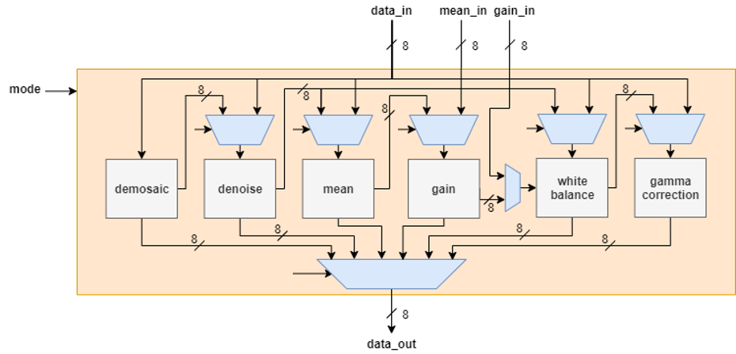

# Image Signal Processor

Typically, image signal processors in cameras or smart phones help convert Bayer raw images into sRGB images. The traditional pipeline for ISP contains four stages: Demosaic, Denoise, White Balance, and Gamma Correction. Without SRAM, we proposed a highly efficient dataflow to reduce the memory access time and the total processing stages to half of the original process in this project. In addition, we increase the usage of registers to further lower the access to pixel data in traditional SRAM.

## Description

The design went through the whole IC design flow, including RTL design, synthesis (see `synthesis/`), APR (see `apr/`), drc verification (see `drc/`), and lvs verification (see `lvs/`). The chip was taped out in .18um process and passed the testing of functionality (see `test_chip/`). See Report.pdf for the implementation details.

## Chip Architecture

